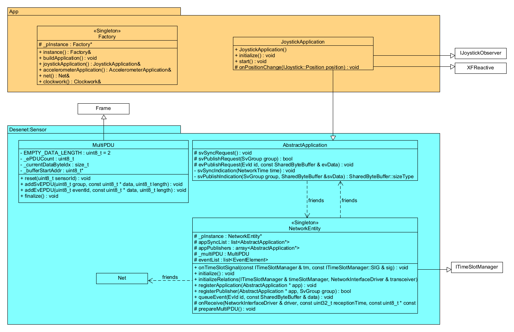
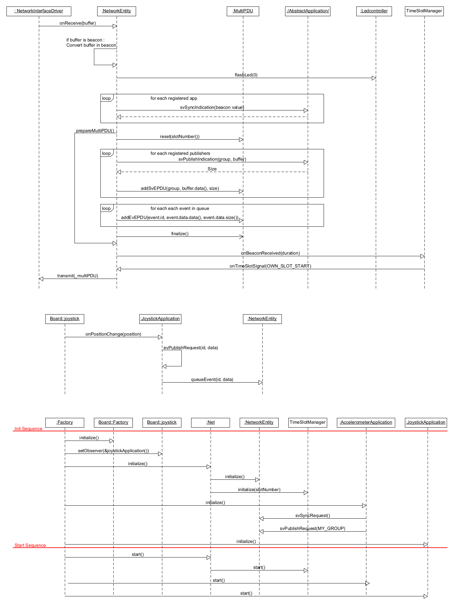

# Desenet Sensor Application

## Project Context
This repository contains the implementation of a sensor node for the **Desenet** wireless protocol, developed on an **STM32 Nucleo-L476RG** platform.

**Note:** This project is built upon a provided middleware and driver framework (Desenet Common, Board Drivers, Execution Framework). The work in this repository focuses specifically on the **Application Layer**, the **Network Entity orchestration**, and the **Frame Construction (MultiPDU)** logic.

## Key Contributions & Implemented Features

The following modules represent the specific engineering contributions added to the base framework:

### 1. Network Entity & Time Synchronization
The `NetworkEntity` class serves as the bridge between the application layer and the radio transceiver.
* **Beacon Synchronization:** Implemented logic to detect network Beacons and synchronize the internal `TimeSlotManager`.
* **TDMA Slot Management:** logic ensures the node transmits data strictly within its assigned time slot to prevent network collisions.
* **Latency Optimization:** Optimized the reception-to-transmission path to eliminate processing delays, ensuring the `MultiPDU` is ready and transmitted within the millisecond-level requirements.

### 2. MultiPDU Frame Construction
Developed the `MultiPDU` class to handle the serialization of heterogeneous data into a single binary network packet.
* **Hybrid Data Packing:** Implemented logic to pack both Sampled Values (SV - Accelerometer) and Event Data (EV - Joystick) into a raw byte buffer.
* **Memory Management:** Utilized `SharedByteBuffer` and pointer arithmetic to manage memory efficiently without redundant copying.
* **Dynamic Structure:** The frame builder dynamically adapts the payload size based on the number of queued events.

### 3. Joystick Application (Event-Driven Architecture)
Designed a robust application to handle asynchronous user inputs, adhering to the **XF Reactive** pattern.
* **Observer Pattern:** Implemented the `IJoystickObserver` interface to capture hardware interrupts.
* **State Machine Implementation:** To comply with the execution framework requirements, the application utilizes a State Machine. This decouples the high-priority hardware interrupt (IRQ) from the network publishing logic.
    * *Acquisition:* The interrupt captures the input and signals the state machine.
    * *Processing:* The `processEvent()` method handles the signal and queues the data for the Network Entity.

### 4. Accelerometer Application (Time-Triggered Architecture)
Integrated the accelerometer data flow to work synchronously with the network cycle.
* **Synchronization:** The application samples X, Y, Z axis data immediately upon Beacon reception (`svSyncIndication`).
* **Publishing:** Data is formatted and pushed to the MultiPDU builder for the upcoming slot.

---

## System Architecture

The architecture separates the hardware abstraction from the network logic. The Network Entity acts as the central coordinator.

### State Machine Design
The Joystick Application avoids blocking operations inside callbacks by utilizing a transition-based state machine.

---

## Technical Specifications

### Communication Protocol
The system operates on a hybrid TDMA (Time Division Multiple Access) model:
1.  **Beacon:** Gateway synchronizes the network.
2.  **Slot:** Each sensor waits for its specific time window.
3.  **Transmission:** The sensor sends a single `MultiPDU` containing:
    * One Sampled Value (Accelerometer).
    * Zero, one, or multiple Events (Joystick).

## Hardware Support
* **Board:** STM32 Nucleo-L476RG
* **Sensors:** Accelerometer, Digital Joystick module.
* **Tools:** STM32CubeIDE, QT creator.